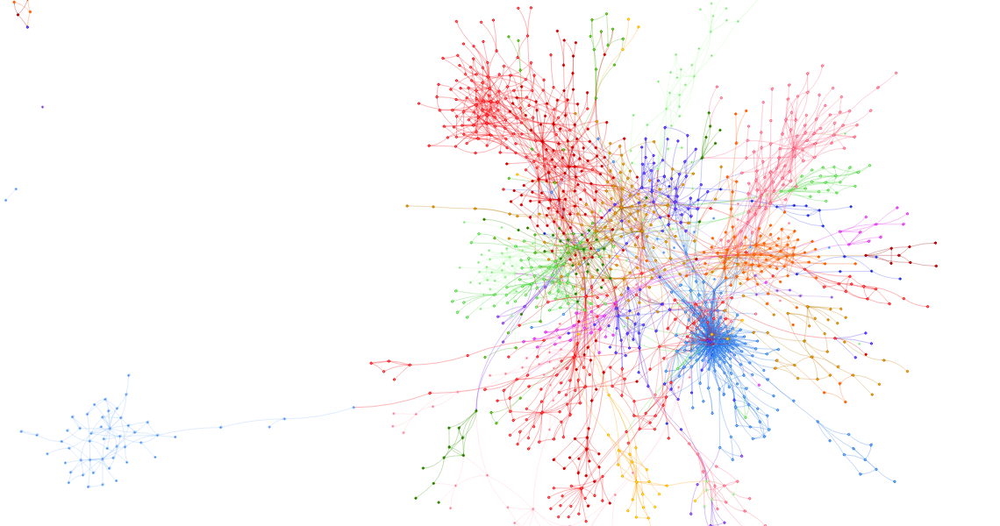

GraPHPizer: Analytics engine for PHP source code
================================================

**Disclaimer**: This project is actively developed and by no means stable. It is completely undocumented. I refuse to
take any responsibility for any kind of amok this program might do on your computer and to provide any kind of support.

## Author and License

Martin Helmich  
This project is [GPL-licensed](LICENSE).

**Background:** This project started off as part of my (not-yet-complete) master's thesis in CS at the [University of Appliced Sciences Osnabrück][hsos]. It has proven it's worth there and I'll probably continue to develop and maintain it.

What is GraPHPizer?
-------------------

GraPHPizer uses graph technologies to offer a source code analytics engine for PHP projects. This includes nifty graph visualizations like the following one:



Features include:

- Graph visualisations (~~completely useless~~ marginally useful, but they look pretty)
- Search your code base using the graph query language *Cypher*
- Automatic generation of UML diagrams from PHP code
- Type inference

Requirements
------------

For operating in production:

- A Java 7 JRE (not 6 and not 8). Thanks, Neo4j.

For development:

- A Java 7 JDK
- An [Activator][activator] installation

Installation
------------

### Production (Docker)

The recommended way to install GraPHPizer is using [Docker][docker]. Use the following command to
create and run a new GraPHPizer container:

    docker run --name graphpizer -d -p 9000:9000 -v /var/lib/graphizer martinhelmich/graphpizer-server:latest

### Production (manual)

Currently, there are no pre-compiled binary versions available. You can compile one yourself using one of the following options:

1.  Package the application into a ZIP file. The resulting ZIP archive will contain the built application with no dependencies (besides a Java JRE) and a `bin/graphpizer-server` executable file

    ```shellsession
    > activator universal:packageZipTarball
    ```

2.  Build a DEB or RPM file using one of the following commands:

    ```shellsession
    > activator debian:packageBin
    > activator rpm:packageBin
    ```

This will create a `.tgz` file in `target/universal` that you can distribute and extract anywhere you like.

### Development quickstart

1. Clone this repository:

    ```shellsession
    > git clone git://github.com/martin-helmich/graphpizer-server.git
    ```

2. Build using Activator:

    ```shellsession
    > cd graphpizer-server
    > activator run
    ```

# First steps

After installing the GraPHPizer server (this project), you can import any number of PHP projects. For this, you'll need to install and configure the [graPHPizer CLI][cli]. For this, perform the following steps:

1.   Install the graphpizer-cli into your PHP project using [Composer][composer]. If you do not have Composer installed, see the [Composer installation instructions][composerinstall]:

    ```shellsession
    > composer require helmich/graphpizer-cli
    ```

    *Alternative*: Install the graPHPizer CLI globally:

    ```shellsession
    > composer global require helmich/graphpizer-cli
    ```

    Add the directory `~/.composer/vendor/bin` to your `$PATH` environment variable.

2.  Create a `.graphpizer.json` configuration file inside your project. There you can configure how the project should be managed in the graPHPizer server.

    See the respective [documentation page][jsonconfig] for more information.

3.  Import the source code into the GraPHPizer server:

    ```shellsession
    > vendir/bin/graphpizer -H <hostname> -P <port> import:ast
    ```

    If your GraPHPizer server is running on the same host as you're running the GraPHPizer CLI on, use `localhost` and `9000` as hostname and port.

4.  You can now find your project in the GraPHPizer server GUI. You can use the *Generate/Update Model* button to trigger the model generation. Note that the model generation (especially the initial generation) may take a while, depending on the size of your project.

    Alternatively, start the model generation using the GraPHPizer CLI:

    ```shellsession
    > vendor/bin/graphpizer -H <hostname> -P <port> generate:model
    ```

5.  You can now use the GraPHPizer web UI to explore your project, use the Cypher query language to analyze your model and to generate nice UML diagrams.

[activator]: https://www.typesafe.com/activator/download
[cli]: https://github.com/martin-helmich/graphpizer-cli
[composer]: http://getcomposer.org
[composerinstall]: https://getcomposer.org/doc/00-intro.md#installation-linux-unix-osx
[docker]: https://www.docker.com
[hsos]: https://www.hs-osnabrueck.de/
[jsonconfig]: https://github.com/martin-helmich/graphpizer-server/wiki/Source-import-configuration
